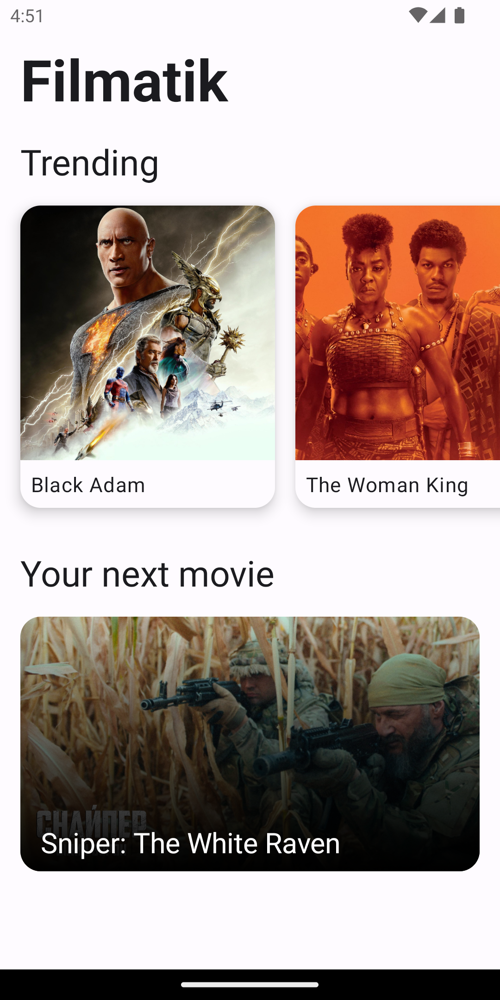
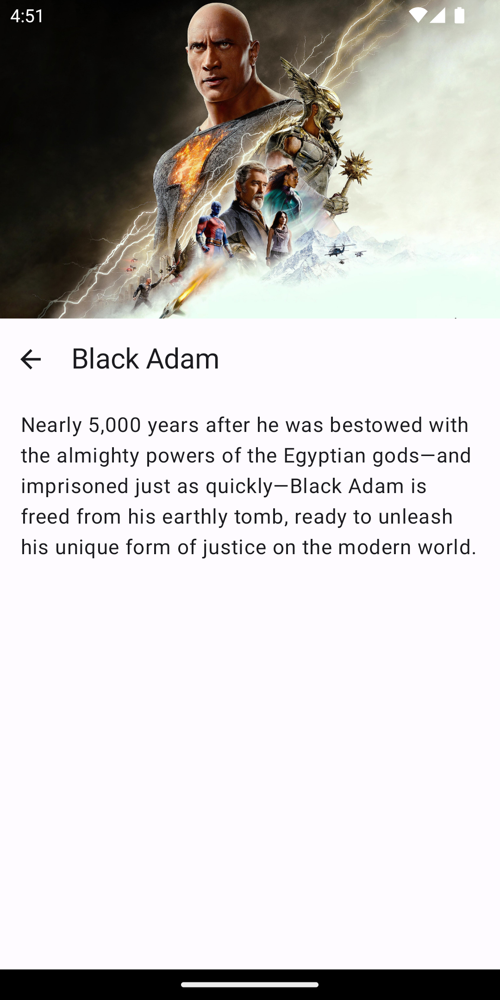
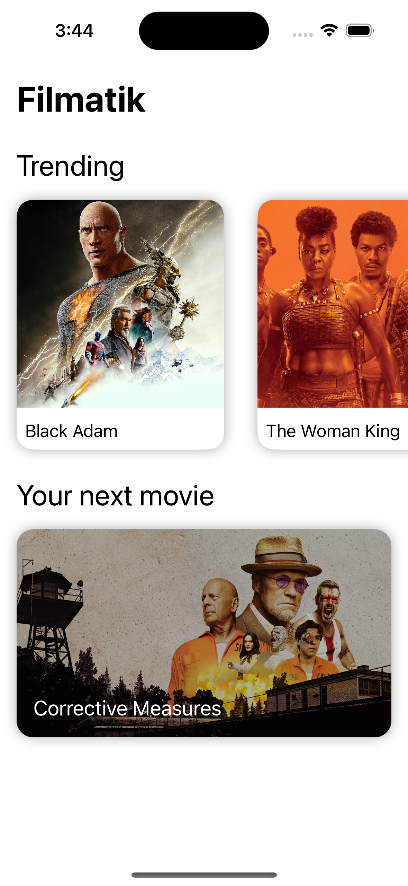
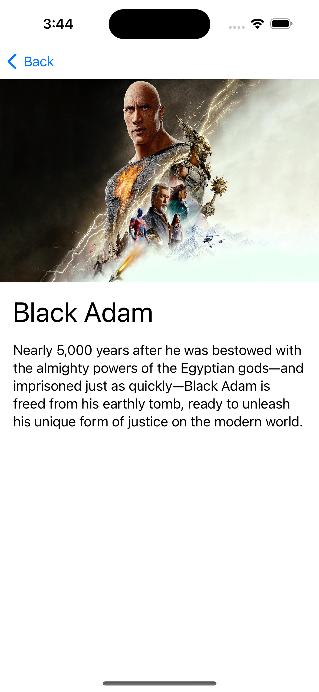

# Filmatik

Filmatik shows you some popular movies of the moment. This project is a minimal Kotlin Multiplatform 
project that I use to experiment with this technology. It is heavily inspired on
[Filmatic](https://github.com/prof18/Filmatic), my other playground application that I use
to catch up with modern Android development.

Right now, the supported platforms are the following: 
- Android (Jetpack Compose)
- iOS (Swift UI)

## Android

<div>
    
    
</div>

## iOS

<div>
    
    
</div>

## How to build:

In order to build the iOS project, you will need to add a `Config.xcconfig` file inside the [iosApp/filmatik](https://github.com/prof18/Filmatik/blob/main/iosApp/filmatik/) folder, with the content of the [Config.xcconfig.template](https://github.com/prof18/Filmatik/blob/main/iosApp/filmatik/Config.xcconfig.template) file.

### API key:

If you want to run the app, you get a TMDB API Key [here](https://www.themoviedb.org/settings/api). 

```xcconfing
TMDB_KEY=<your-api-key>
```

On Android, you must include the API Key in the `local.properties` in the root project dir:

```properties
tmdbKey=<your-api-key>
```

## Libraries used:

- [Kotlin Coroutines](https://kotlinlang.org/docs/coroutines-overview.html)
- [Ktor](https://ktor.io/)
- [Kotlin Serialization](https://github.com/Kotlin/kotlinx.serialization)
- [Kermit](https://github.com/touchlab/Kermit)
- [Jetpack Compose](https://developer.android.com/jetpack/compose)
- [Coil](https://github.com/coil-kt/coil)
- [Koin](https://insert-koin.io/)
- [Detekt](https://github.com/detekt/detekt)

